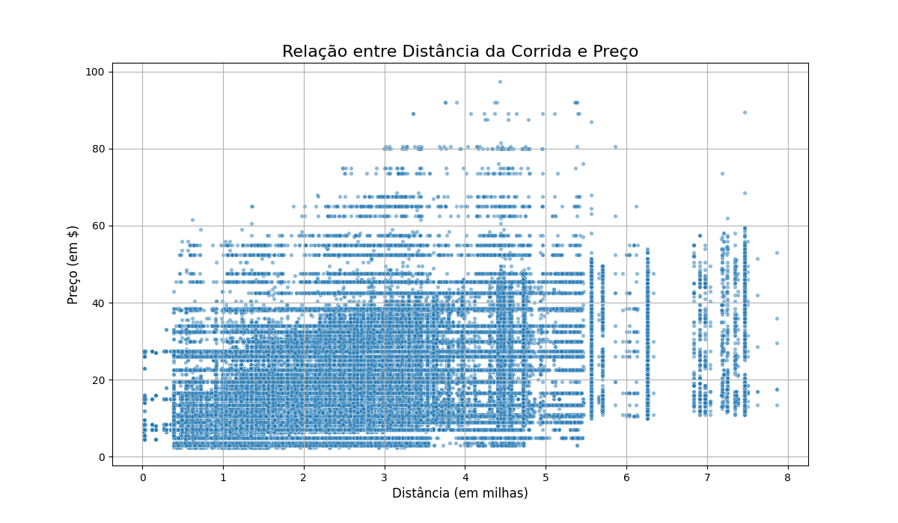
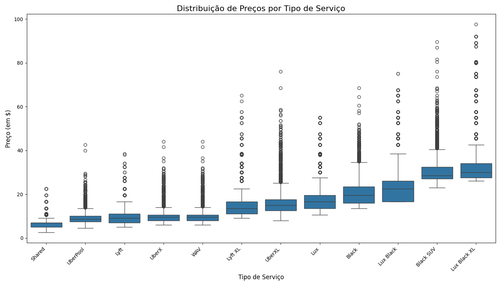
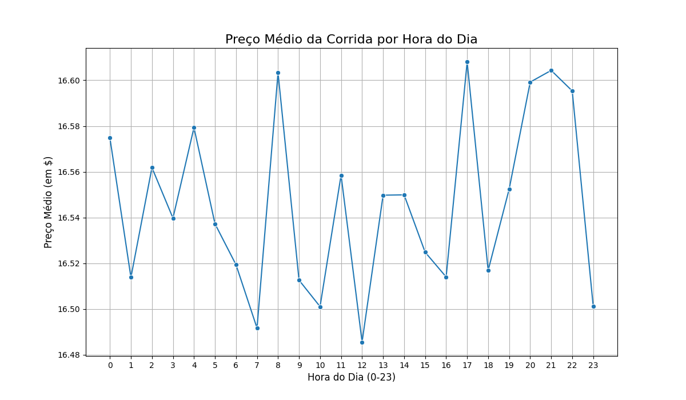
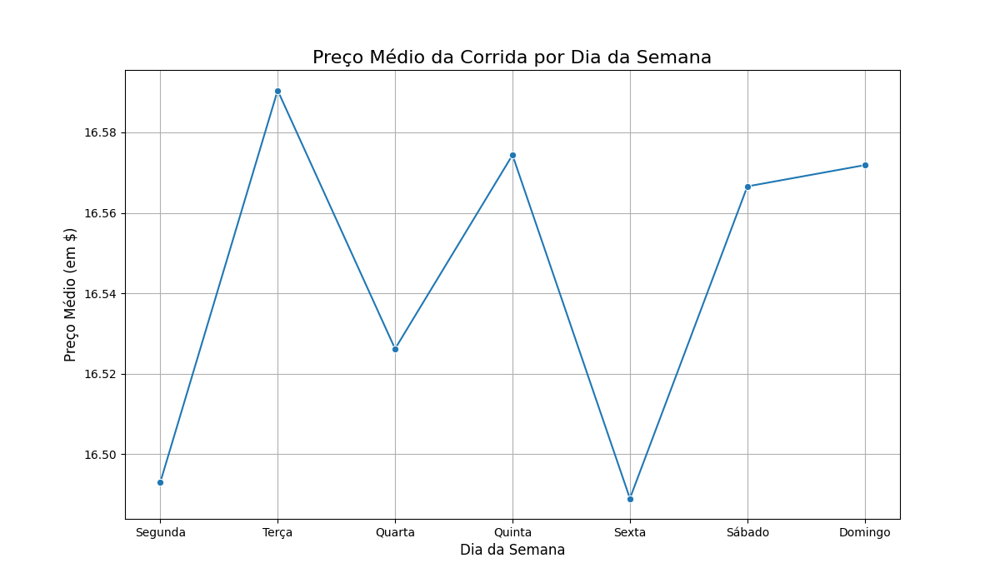
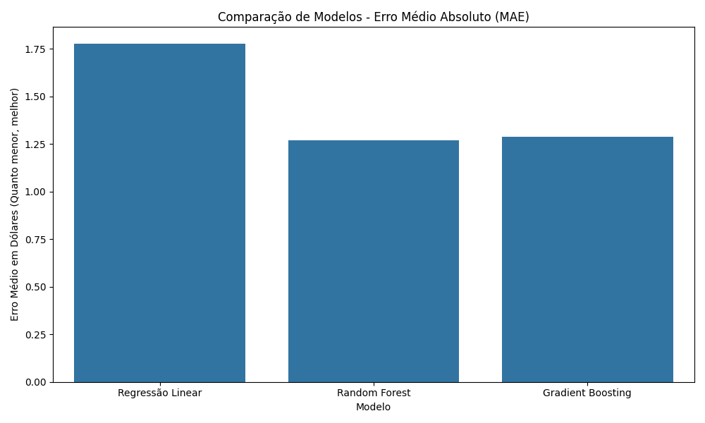
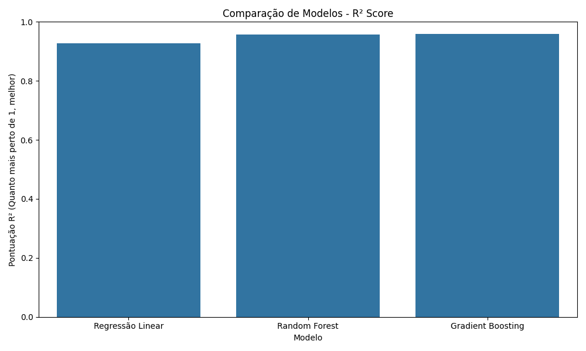

# 🚗 Previsão de Preços de Corridas (Uber & Lyft)     
 Projeto de Regressão

Este projeto contém um pipeline completo de ML para prever o preço de corridas de serviços como Uber e Lyft. Utilizando um dataset público de Boston, o objetivo foi realizar uma análise exploratória profunda, aplicar técnicas de engenharia de features, e comparar múltiplos modelos de regressão para encontrar a solução mais precisa para estimar o valor de uma corrida.

### 🎯 Pergunta principal

O objetivo central do projeto foi responder à seguinte pergunta:
> "É possível construir um modelo de Machine Learning que estime o preço de uma corrida com base em fatores como distância, tipo de serviço, tempo e clima?"

### 🛠️ Tecnologias e Setup

- **Linguagem:** Python
- **Bibliotecas Principais:** Pandas, Scikit-learn, Matplotlib, Seaborn
- **Para executar o projeto:** 

  1. Clone o repositório.
  2. Crie um ambiente virtual e instale as dependências com `pip install -r requirements.txt`.
  3. Execute o script `treinamento_e_analise.py` para rodar todo o pipeline de análise e salvar o modelo final.
  4. Execute o script `predict.py` para usar o modelo treinado e estimar preços de novas corridas.

### 🧠 Análise em gráficos

A solução foi construída como uma investigação, onde cada gráfico revelou uma nova pista sobre os fatores que influenciam os preços.

### Distância e Tipo de Serviço

A investigação começou com as duas variáveis mais intuitivas.

**1.1. A Relação entre Distância e Preço**

O gráfico de dispersão mostrou que, embora o preço tenda a aumentar com a distância, a variação é enorme. Para uma mesma distância, os preços podem variar drasticamente, provando que a **distância, sozinha, não é suficiente para explicar o preço**.

**1.2. A Distribuição de Preços por Tipo de Serviço**

Este boxplot revelou "degraus" de preços muito bem definidos. Serviços compartilhados (`Shared`, `UberPool`) são os mais baratos, enquanto serviços de luxo (`Lux Black XL`, `Black SUV`) são consistentemente mais caros. A **escolha do tipo de serviço é um preditor fundamental**.

### O fator tempo

Com a criação de features a partir do `timestamp`, foi possível analisar o impacto do tempo.

**2.1. O Preço Médio por Hora do Dia**

Este gráfico de linhas confirmou o padrão de **horários de pico**. Os preços médios sobem visivelmente às **8h** e entre **17h-18h**, coincidindo com os horários de deslocamento para o trabalho.

**2.2. O Preço Médio por Dia da Semana**

O padrão semanal também se mostrou relevante. A Sexta-feira tende a ser mais barata em média (provavelmente com menos viagens corporativas longas), enquanto os preços sobem no fim de semana para viagens de lazer.

### 📊 Resultados

Após a preparação completa das features, três modelos de regressão foram treinados e comparados.

| Modelo | MAE (Erro Médio $) | R² Score |
| :--- | :--- | :--- |
| Regressão Linear | $1.77 | 0.927 |
| **Random Forest** | **$1.26** | 0.957 |
| Gradient Boosting | $1.28 | **0.959** |

**Análise de Performance:**

Os modelos Random Forest e Gradient Boosting se mostraram muito superiores. O Gradient Boosting teve o maior poder explicativo (R²), mas o **Random Forest foi o campeão em errar por menos em média (menor MAE)**. Por ser uma métrica mais direta e fácil de comunicar, o **Random Forest foi escolhido como o modelo final**.

### 🚀 Aplicação
O projeto culmina em um script de previsão (`predict.py`) que carrega o modelo Random Forest treinado e o utiliza para estimar os preços de novas corridas, demonstrando a aplicação prática de todo o estudo.

### 📄 Data source

Os dados utilizados neste projeto são públicos e foram disponibilizados na plataforma Kaggle.

**Dataset:** [Uber and Lyft Dataset Boston, MA](https://www.kaggle.com/datasets/brllrb/uber-and-lyft-dataset-boston-ma)

### 🔮 Melhorias Futuras

Este projeto estabelece uma base sólida para a previsão de preços, mas pode ser aprimorado com as seguintes etapas:

- **Engenharia de Features Geográficas:** A maior oportunidade de melhoria está no uso das colunas `source` e `destination`. Atualmente não utilizadas por terem milhares de valores únicos, elas poderiam ser convertidas em features poderosas, como:
    - Distância do centro da cidade.
    - Agrupamento por bairros ou zonas de preço.
    - Identificação de locais de alta demanda (aeroportos, estações, etc.).

- **Inclusão de Dados Climáticos:** As colunas de clima (`temperature`, `precipProbability`, etc.) foram deixadas de fora nesta primeira versão devido a valores ausentes. Uma próxima etapa seria aplicar técnicas de "imputação" para preencher esses dados e testar seu impacto no modelo.

- **Otimização de Hiperparâmetros:** Utilizar ferramentas como `GridSearchCV` ou `RandomizedSearchCV` para encontrar a combinação ótima de parâmetros para os modelos campeões (Random Forest e Gradient Boosting), potencialmente aumentando ainda mais a precisão.

- **Testar Modelos Avançados:** Experimentar com algoritmos de Gradient Boosting mais modernos e eficientes, como `XGBoost` ou `LightGBM`, que são frequentemente usados em competições de ciência de dados.

### 👨‍💻 Desenvolvido por

Este projeto foi desenvolvido por mim, **Maurício J Souza**, como uma demonstração de habilidades em ciência de dados e machine learning.

Para considerações, perguntas ou oportunidades, sinta-se à vontade para me encontrar em:

